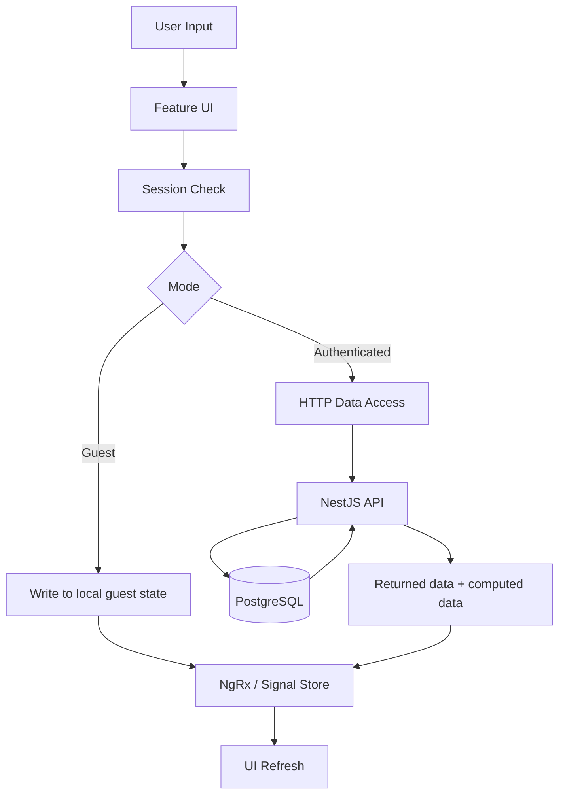

# Session-Based Write Flow with NgRx Store and API Persistence

## Context

Guest mode writes locally, while authenticated mode persists through API and PostgreSQL.

## Diagram

## Notes

- Feature components should not depend directly on auth state.
- Session mode decides which write path is used.
- Authenticated writes are confirmed by the backend before store update.
